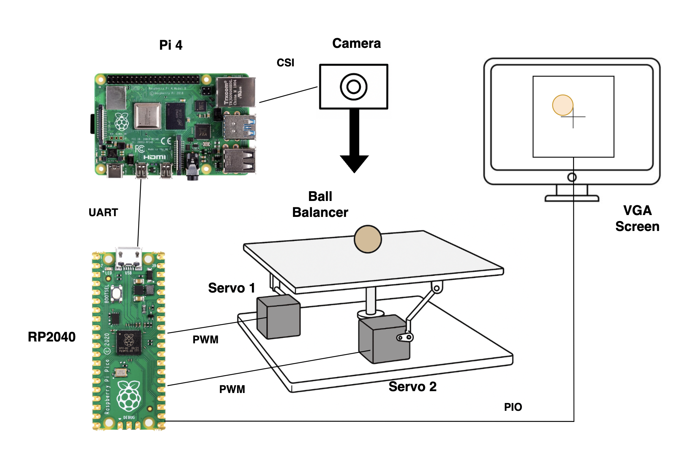
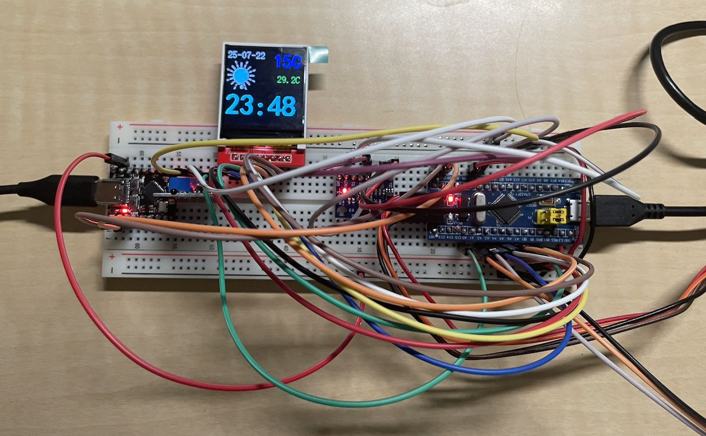

## Electrical projects

**Wetland Flux Chamber** 

Accurate, long-duration field measurements of methane (CH₄) and carbon dioxide (CO₂) flux are essential for environmental monitoring and climate policy. In this project, we developed a low-power embedded data logger for use in portable flux chambers, enabling autonomous environmental sensing over multi-day deployments. The system is built around a Raspberry Pi Pico and integrates both a digital SCD30 sensor (for CO₂, temperature, and humidity) and an analog methane sensor via ADC. Sensor data is timestamped using the onboard RTC and logged to a microSD card in CSV format using the FatFs library. To conserve power, the Pico enters a sleep state between logging cycles and wakes on hardware timer alarms. All firmware was written in C using protothreads and tested across 10 field-ready chamber prototypes for deployment in wetlands, agricultural fields, and manure management sites.

To support long-term stability and field reliability, we designed a custom PCB that consolidates the entire electronics system—power management, sensors, storage, and interface connections—into a compact, robust layout. We implemented watchdog timers and error recovery routines to ensure the logger could autonomously recover from temporary faults such as I2C hangs or sensor communication errors. These improvements significantly enhanced system uptime, allowing multi-day logging without interruption. The final system reflects a complete embedded solution, combining environmental sensing, ultra-low power operation, resilient firmware, and hardware integration suitable for real-world environmental research.

Github: <a href="https://cornellfluxchamber.github.io/">Cornell Flux Chamber</a>

**Smart Dorm IOT System**

This project is a Wi-Fi-connected smart dorm automation system built using a combination of ESP32 and Raspberry Pi Pico W microcontrollers. It integrates multiple subsystems: a AHT20 temperature/humidity sensor-controlled fan (ESP32), a distance-based light control system (Pico W), a PIR montion sensor-controlled signal system of outdoor status and a magnetic door sensor (Pico W) that detects whether the bathroom door is open or closed, indicating occupancy. All sensor data is transmitted over MQTT via Wi-Fi to a centralized broker, allowing for remote monitoring and control. Devices subscribe to control topics and publish real-time status updates, enabling seamless interaction through a custom web-based dashboard with button controls and state indicators.

Sensors are interfaced using the I2C protocol, and PWM is used to drive fan and light switches for precise control. In addition to sensor-actuator loops, the system includes a room status display: a display outside the room signals occupancy or availability based on motion detection and manual override. Together, these components form a cohesive embedded system that demonstrates wireless communication, MQTT messaging, I2C and PWM peripherals, and real-time web integration—designed specifically for convenience, automation, and energy awareness in a college dorm setting.

Github: <a href="https://github.com/Rachelyan666/smart_dorm_iot">Smart Dorm IOT System</a>

**Ball Balancing PID Platform**

Balancing a ball on a surface is a classic control problem that involves detecting the ball’s position in real time and adjusting the platform’s orientation accordingly. In this project, we built a two-degree-of-freedom ball balancing system using a Raspberry Pi 4, RP2040 microcontroller, servo motors, and a custom platform made from acrylic and 3D-printed parts.

The Pi Camera captures the ball’s position in real time, and the Raspberry Pi uses a computer vision algorithm to track the ball's movement. The position data is then sent to the RP2040 through UART. The microcontroller runs a PID control algorithm that calculates the servo angles needed to tilt the platform and stabilize the ball. The ball’s position is also displayed in real time on a VGA screen as visual feedback. By isolating the x and y directions, we successfully balanced a 1-inch diameter ball on the platform.

Github: <a href="https://ece4760.github.io/Projects/Spring2025/tll68_sy625/index.html">Ball Balancer</a>

**Weather Clock Project**

This project is a Wi-Fi-connected weather and temperature display system built using an STM32F103 microcontroller, a ESP32-C2 wifi board, and an ST7735 LCD. The ESP32-C2 connects to the internet, retrieves live weather and time data from OpenWeatherMap, and sends a compact summary—location, weather condition, temperature, and timestamp—via UART communication with the AT commands to the STM32. The STM32 parses the data and renders it on the LCD with accompanying weather icons and digital clock output.

The system also features an onboard NTC thermistor for ambient temperature sensing via ADC, and an MPU6050 accelerometer connected over I2C to detect device orientation. Based on tilt, the screen automatically rotates its contents for better viewing. This project integrates wireless communication, USART communication, I2C sensor interfacing, ADC measurement, DMA for accelerated data transfer and SPI-based graphical output in a compact, responsive embedded system.

Github: <a href="https://github.com/Rachelyan666/weather_clock">Weather Clock</a>

**Kitchen Alarm System**

This project implements a real-time gas monitoring and alert system using FreeRTOS ported to the STM32F103C8T6 microcontroller. We manually integrated FreeRTOS from source and configured it to run on the STM32 platform, enabling structured multitasking for multiple sensors and peripherals. The system reads from analog gas sensors—MQ2 and MQ9B—to detect smoke, carbon monoxide (CO), and methane (CH₄), along with an additional ADC-based temperature sensor. Each sensor is managed by its own FreeRTOS task, allowing efficient and predictable scheduling of sampling, threshold checks, and actuator responses. A buzzer provides immediate local alerts for hazardous gas levels, and a OLED display (connected via I2C) displays real-time sensor data.

All sensors communicate through STM32's ADC subsystem, and critical alerts are sent remotely via MQTT using an ESP8266 Wi-Fi module. When gas or temperature levels exceed safe limits, the system publishes warning messages to a phone-based IoT application, allowing for timely remote intervention. FreeRTOS ensures deterministic behavior even under load, handling ADC reads, alarm triggering, display updates, and MQTT communication concurrently. This project demonstrates a robust embedded system that combines RTOS task management, analog sensing, I2C interfacing, and cloud connectivity for real-time environmental safety and monitoring.

Github: <a href="https://github.com/Rachelyan666/kitchen_alarm">Kitchen Alarm System</a>

**Tide Displayer**

In general, our system works by sending tidal data from the NXP FRDM-KL46Z board using skills we learned this semester, and then use the arduino to receive and process the data, which finally controlls the LED strip to turn on and off showcasing the tide.

In this project, we accomplished and practices a lot of skills that we learn in this class. For example, in hardware, we practiced wire soldering a lot in the project. Then, in the FRDM-KL46Z code, we accomplished sending data using UART serial communication, as well as the real-time scheduling that we learned by the end of the semester. Finally, in Arduino code, we accomplished receiving data in UART, as well as data decode and other programming skills.

Github: <a href="https://pages.github.coecis.cornell.edu/ece3140-sp2023/jnl77-sy625-xf37/">Tide Clock</a>

**Embedded Mahjong Player**

Mahjong is a type of Chinese board game where four players are required for a game. Often times, people find it hard to always find four people for the game, often there are only three. Therefore, it became a problem that a fourth player is needed. To solve this problem, our team worked on the embedded mahjong player, so that it can play along as the extra player to help start the game.

Our project first uses the Pi Camera to take photos of Mahjong tiles, and uses the photos to train the computer vision model, and then uses the trained model to identify the tiles. Next, the Mahjong algorithm would determine which tile it should play this round, and send the instruction to the PiTFT and servo to indicate the played tile. Displays and buttons on the PiTFT are also used as round controls. 

Github: <a href="https://github.com/colonel-aureliano/Embedded-Mahjong-Bot">Embedded Mahjong Bot</a>

**Theater Actor Auto Follow Light System** [**In Progress**]

In theater productions, a follow spot is often used to highlight the lead actor on stage. Traditionally, this spotlight is manually controlled, which can be labor-intensive and may not always keep up with fast-moving performances. To solve this problem, our team is developing an automated actor tracking spotlight system that can follow the actor in real-time without human control.

Our project uses a Raspberry Pi and infrared tracking techniques to detect the actor's position on stage. The actor is equipped with an infrared-emitting marker, and sensors or Pi-compatible NoIR cameras are used to detect the IR signal. The position data is then processed to calculate the actor’s location and send commands to a motorized spotlight to pan and tilt accordingly. This system aims to improve spotlight accuracy and reduce manual operation in live theater environments.

 

## Software Projects

**Stardew Chatbot**

This project implements a conversational assistant for game Stardew Valley, built using Python, the Autograms framework, and OpenAI’s API. The chatbot provides players with quick access to in-game knowledge through natural dialogue, acting as a guide for important mechanics. It covers areas such as villager gifts (including universal likes and loves), money-making strategies, fishing information, and crafting or cooking recipes, allowing players to ask questions and receive detailed answers in real time.

The project demonstrates techniques for building interactive dialogue systems, combining structured prompts with domain-specific knowledge retrieval. Users can query the bot in different modes, such as calculating required resources to reach a gold target, listing available fish given in-game conditions, or identifying how to obtain recipes. The modular design makes the chatbot extensible, showcasing practical integration of game data with conversational AI for an engaging user experience.

Github: <a href="https://github.com/Rachelyan666/stardew_chatbot#">Stardew Bot</a>

**LTL interpreter**

This project is a interpreter written by Ocaml that transfers a natural language that follows LTL rules into an automata graph.

This is a tool that can translate everyday language into something a machine understands. LTL logic, which is the Linear Temporal Language (LTL) will be transformed into Büchi Automata.

This converter takes in strictly-formatted human language, parses and synthesizes it into a simplified Linear Temporal Logic expression, and converts it into a reliable Büchi automaton that is visualized and verifiable. With the automaton being generated, the user is able to verify if their subsequent tentative actions is executable.

Github: <a href="https://github.com/JLjw8/LTL2Buchi">Interpreter</a>

**Ultimate Tic-Tac-Toe AI Player**

This project implements an AI agent built to play Ultimate Tic-Tac-Toe, implemented in Python with a AI algorithms and Pygame-based graphical interface.

The project explores classic game AI techniques including Minimax search, Alpha-Beta pruning, and heuristic evaluation functions tailored for the unique rules of Ultimate Tic-Tac-Toe. The AI is capable of playing strategically on both the macro and micro boards, adapting to changing board states and forcing favorable positions. The rules of valid move restrictions and win propagation are fully enforced.

Users can play against the AI in an interactive GUI and toggle between different levels of difficulty. The project also includes testing infrastructure and tools for analyzing AI performance over multiple games.

Github: <a href="https://github.com/Rachelyan666/Ultimate-tic-tac-toe">AI Ultimate tic-tac-toe player</a>

